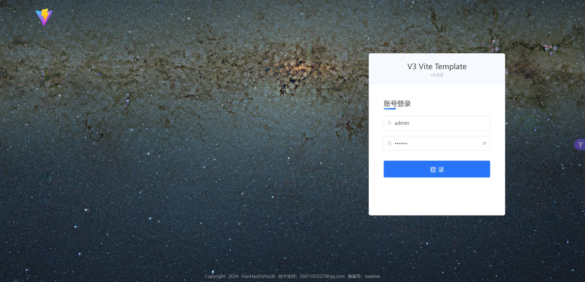
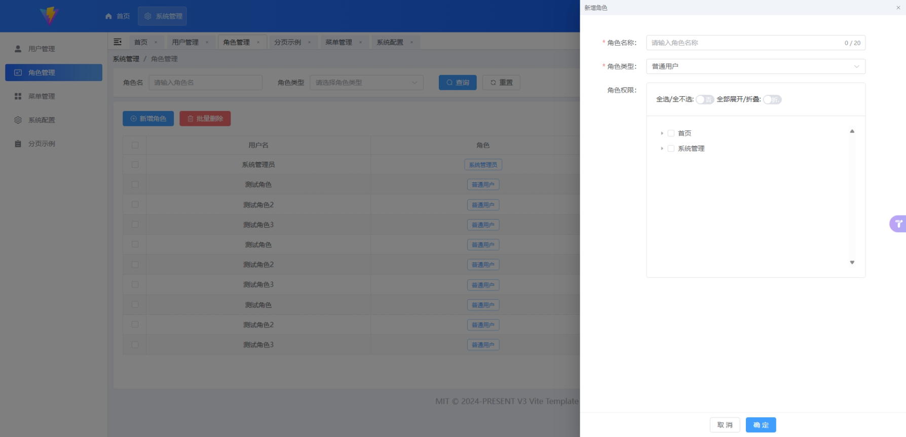
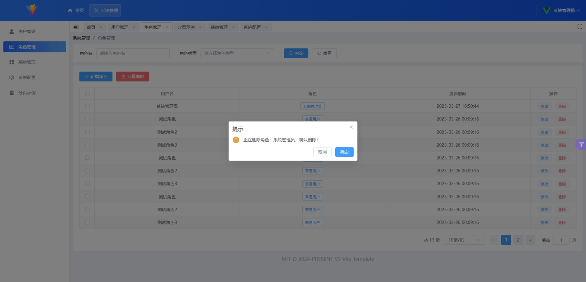

# H-Sys-Manage
单一项目的系统管理系统，技术采用：JDK21，SpringBoot3，Vue3，Vite，TS，等主流技术，也可升级为SpringCloud版本

后端项目：[sys-manage](sys-manage/README.md)

前端项目：[sys-manage-vue](sys-manage-vue/README.md)

## 功能点 

- 首页
  - [x] 首页示例
- 工作台
  - [ ] 流程配置
- 系统管理
  - [ ] 文件中心
  - [x] 接口管理
  - [x] 用户管理
  - [x] 角色管理
  - [x] 菜单管理
  - [x] 系统配置
  - [x] 分页示例

## 界面示例

----
